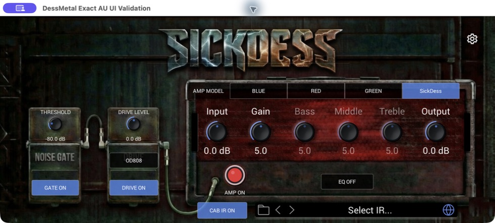

# DessMetal

DessMetal is a free macOS guitar amp simulator I made for a simple reason: I wanted to digitize some of my equipment and take those sounds with me.

It started from the open-source [Neural Amp Modeler](https://github.com/sdatkinson/NeuralAmpModelerPlugin) project. I used NAM's neural modelling engine, then built a focused amp sim around it. The part I most wanted to try was a real parametric Gain knob instead of a collection of fixed capture snapshots.



## What you get

- Four amp voicings: **DessTortion Blue**, **DessTortion Red**, **DessBlock Green**, and **SickDess**
- Four drive models: **OD808**, **SD1**, **TS9**, and **aesahaettr**
- Sixteen cabinet impulse responses
- Noise gate, three-band EQ, input and output controls
- Separate Drive, Amp, EQ, and Cabinet bypass controls
- Standalone app, Audio Unit v2, and VST3 plug-in

Version 0.1.1 is for macOS. It is a universal build for Intel and Apple Silicon Macs. Windows project files exist, but I have not built or validated a Windows release yet.

## Why the Gain knob is different

Most NAM captures freeze a rig at one setting. For each DessMetal amp voicing, I recorded its rig at several Gain positions and trained a conditioned WaveNet for the knob position. While you play, the plug-in maps Gain from 2 to 8 onto that conditioning value and feeds it into the selected model.

So this is not a crossfade and it does not swap models at every step. Each model learned how its captured rig changes across the recorded settings, which lets the knob move continuously between them. That is the little experiment at the heart of this project.

## Install on macOS

DessMetal 0.1.1 supports Intel macOS 10.15 or later and Apple Silicon macOS 11 or later.

1. Download and open `DessMetal-v0.1.1-mac.dmg` from the Releases page.
2. Run `DessMetal-v0.1.1-mac.pkg`.
3. Choose the formats you want, finish the installation, then restart or rescan your audio host.

The installer writes to:

- `/Applications/DessMetal.app`
- `/Library/Audio/Plug-Ins/Components/DessMetal.component`
- `/Library/Audio/Plug-Ins/VST3/DessMetal.vst3`

Logic Pro uses the Audio Unit. Other hosts may use either AUv2 or VST3.

## Plug in

1. Connect your guitar through an audio interface and set a healthy input level without clipping.
2. Open the standalone app, or add DessMetal to an audio track in your DAW.
3. Pick an amp, choose a drive if you want one, and move the Gain knob.
4. Try the cabinet IRs, EQ, and bypass switches to shape the full signal path.

The settings page also includes input calibration and output modes for rigs that need more careful level matching.

## Build it yourself

You need macOS, Xcode with the command-line tools, and CMake. The required source dependencies are included in this repository.

Run the core tests from the repository root:

```bash
cmake -S NeuralAmpModelerCore -B /tmp/dessmetal-core-build -DCMAKE_BUILD_TYPE=Debug
cmake --build /tmp/dessmetal-core-build --target run_tests -j 8
(cd NeuralAmpModelerCore && /tmp/dessmetal-core-build/tools/run_tests)

bash AudioDSPTools/tests/run_wav_tests.sh
bash NeuralAmpModeler/tests/run_unserialization_layout_tests.sh
```

Build the universal standalone app, AUv2, VST3, installer, and DMG without release credentials:

```bash
./package_mac.sh --unsigned
```

Unsigned output is for local development and testing. See [CONTRIBUTING.md](CONTRIBUTING.md) before sending a change.

## Where I would like to take it

I would love to turn this into a free, open capture tool so anyone can digitize a rig and build parametric captures without having to assemble the whole training pipeline by hand. Gain is only the start; the same idea could eventually cover more knobs and more of the way a real amp responds.

One route might be active learning: instead of recording every possible knob combination, the tool could suggest the next settings that would teach the model the most. That is not a roadmap promise, just something I think is worth exploring.

## Try it and tell me what you think

I made this because it was fun, and I think it sounds great. Try it with your own guitar and tell me what you think. If something breaks, your DAW behaves strangely, or you have an idea for what this should become, open an issue in this repository so we can work on it together.

DessMetal builds on Neural Amp Modeler and [iPlug2](https://github.com/iPlug2/iPlug2). The source code is available under the [MIT License](LICENSE). Bundled assets and dependencies have their own notices in [THIRD_PARTY_NOTICES.md](THIRD_PARTY_NOTICES.md).

Product and company names belong to their respective owners. DessMetal is not affiliated with or endorsed by those manufacturers.
